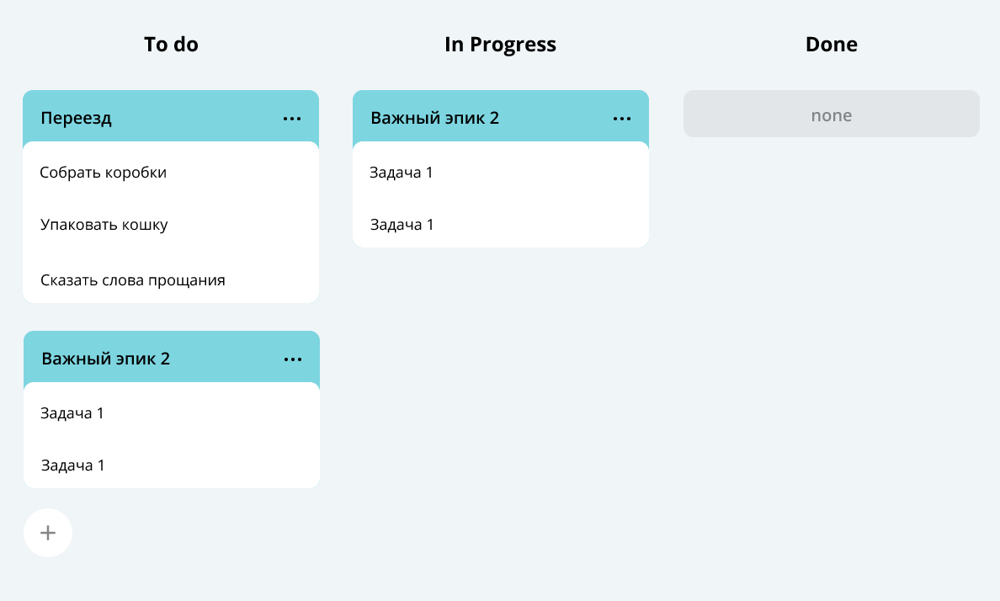

# java-kanban
Технологии: Java (no frameworks) + JUnit + GSON + RESTful API

### Трекер задач.

Как человек обычно делает покупки? Если ему нужен не один продукт, а несколько, то очень вероятно, что сначала он 
составит список, чтобы ничего не забыть. Сделать это можно где угодно: на листе бумаги, в приложении для заметок или, 
например, в сообщении самому себе в мессенджере.

А теперь представьте, что это список не продуктов, а полноценных дел. И не каких-нибудь простых вроде «помыть посуду» 
или «позвонить бабушке», а сложных — например, «организовать большой семейный праздник» или «купить квартиру». Каждая 
из таких задач может разбиваться на несколько этапов со своими нюансами и сроками. А если над их выполнением будет 
работать не один человек, а целая команда, то организация процесса станет ещё сложнее.
Программа, отвечающая за формирование модели данных для этой страницы:


#### В данном коде реализовано:

- Создание задачи, подзачи, эпика.
- Получение списка всех задач.
- Обновление задачи, подзачи, эпика.
- Удаление всех задач.
- Получение по идентификатору.
- Удаление по идентификатору.
- Получение списка всех подзадач определённого эпика.
- Обновление статуса выполнения.
- Хранение истории просмотра пользователем задач.

#### У задачи (task) есть следующие свойства:

- **Название (`name`)**, кратко описывающее суть задачи (например, «Переезд»).
- **Описание (`description`)**, в котором раскрываются детали.
- **Уникальный идентификационный номер задачи (`id`)**, по которому её можно будет найти.
- **Статус (`status`)**, отображающий её прогресс. Выделяются следующие этапы жизни задачи:
1. `NEW` — задача только создана, но к её выполнению ещё не приступили.
2. `IN_PROGRESS` — над задачей ведётся работа.
3. `DONE` — задача выполнена.
- **Продолжительность (`duration`)** - оценка того, сколько времени она займет в минутах.
- **Дата и время начала задачи (`startTime`)**, когда предполагается приступить к выполнению задачи.
- **Владелец задачи (`user`)**, пользователь, авторизованный в приложении. 

Время завершения рассчитывается исходя из `startTime` и `duration` и возвращается методом `getEndTime()`.\
Задача может содержать **подзадачи** _(subtask)_. Задача, которая делится на подзадачи называется **эпик** _(epic)_.\
Продолжительность эпика — сумма продолжительности всех его подзадач. Время начала — дата старта самой ранней подзадачи, 
а время завершения — время окончания самой поздней из задач. Поля `duration` и `startTime` этого класса расчётные. 
В `Epic` присутствует поле `endTime`, которое рассчитывается с другими полями.

Таким образом, в нашей системе задачи могут быть трёх типов: обычные задачи, эпики и подзадачи. Для них должны 
выполняться следующие условия:
- Для каждой подзадачи известно, в рамках какого эпика она выполняется.
- Каждый эпик знает, какие подзадачи в него входят.
- Завершение всех подзадач эпика считается завершением эпика.

Задачами управляет Менеджер задач. Его основные общие функции:
1. Возможность хранить задачи всех типов.
2. Методы для каждого из типа задач(Задача/Эпик/Подзадача):\
a. Получение списка всех задач.\
b. Удаление всех задач.\
c. Получение по идентификатору.\
d. Создание. Сам объект должен передаваться в качестве параметра.\
e. Обновление. Новая версия объекта с верным идентификатором передаётся в виде параметра.\
f. Удаление по идентификатору.
3. Дополнительные методы:\
a. Получение списка всех подзадач определённого эпика.
4. Управление статусами осуществляется по следующему правилу:\
a. Менеджер сам не выбирает статус для задачи. Информация о нём приходит менеджеру вместе с информацией о самой задаче. 
По этим данным в одних случаях он будет сохранять статус, в других будет рассчитывать.\
b. Для эпиков:\
-- если у эпика нет подзадач или все они имеют статус `NEW`, то статус должен быть `NEW`.\
-- если все подзадачи имеют статус `DONE`, то и эпик считается завершённым — со статусом `DONE`.\
-- во всех остальных случаях статус должен быть `IN_PROGRESS`.

Указанные функции реализованные в классе `InMemoryTaskManager`, имплементирующий интерфейс `TaskManager`. Класс Task - родитель. 
Subtask и Epic - наследники. Такая структура дает возможность не только изменять свойство сразу у всех видов задач, но и отдельно у каждой.

### История просмотров задач

В одном из вариантов реализации, функционалы добавления просмотра и хранения истории просмотра задач пользователем реализованы в классе 
`InMemoryHistoryManager`, имплементирующий интерфейс `HistoryManager`.\
Просмотром считается вызов у менеджера методов получения задачи по идентификатору - `getTask()`, `getSubtask()` и `getEpic()`.\
Программа запоминает порядок вызовов метода `add` у задач, и именно в этом порядке просмотры записываются в историю. 
Для хранения порядка вызовов используется специально написанная реализация связанного списка `CustomLinkedList`.\
Если какая-либо задача просматривалась несколько раз, в истории отобразится только последний просмотр. 
Предыдущий просмотр будет удалён сразу же после появления нового — за `О(1)`. 
Стандартная реализация `LinkedList` в данном случае не подойдёт. \
`CustomLinkedList` позволяет удалить элемент из произвольного места за `О(1)` с одним важным условием — если программа 
уже дошла до этого места по списку. Чтобы выполнить условие, в реализацию внедрена стандартная `HashMap`. 
Её ключ - id задачи, просмотр которой требуется удалить, а значение — место просмотра этой задачи в списке, 
то есть узел связного списка. С помощью номера задачи можно получить соответствующий ему узел связного списка и удалить его.\
Реализация метода `getHistory` интерфейса `HistoryManager` перекладывает задачи из связного списка в `ArrayList` для формирования ответа.\
Задачи сортируются по приоритету - то есть по `startTime`. Если дата старта не задана, задача добавляется в конец списка задач, 
подзадач, отсортированных по `startTime`. Реализация метода `getPrioritizedTasks`, возвращает список задач и подзадач в заданном порядке.
Предполагается, что пользователь будет часто запрашивать этот список задач и подзадач, поэтому подобрана структура данных для хранения, 
со сложностью получения не хуже `O(n)`.\
 \
Предполагается, что пользователь будет выполнять не более одной задачи за раз. Трекер проверяет, что задачи и подзадачи 
не пересекаются по времени выполнения. Реализована валидация во время создания или изменения задач, подзадач.
  

### Хранение задач и истории в файле

В одном из реализованных функционалов, после каждой операции все задачи, их состояние и история просмотра автоматически 
сохраняются в специальный файл.
За это отвечает вторая реализация интерфейса `TaskManager` - `FileBackedTasksManager`. Кроме этого он наследует от `InMemoryTasksManager`, 
от которого получает желаемую логику работы менеджера и дополняет ее в нужных местах функцией сохранения в файл. 
- Метод автосохранения.\
`FileBackedTasksManager` получает путь к файлу для автосохранения в своём конструкторе. Метод `save()` сохраняет 
текущее состояние менеджера в указанный файл. Каждая модифицирующая операция сначала выполняет версию, унаследованную от предка, 
а затем — метод `save`. Сохранение происходит в файл в текстовом формате CSV. Файл с сохранёнными данными будет выглядеть так:
```agsl
id,type,name,status,description,epic
1,TASK,Task1,NEW,Description task1,
2,EPIC,Epic2,DONE,Description epic2,
3,SUBTASK,Sub Task2,DONE,Description sub task3,2

2,3 
```
- Метод загрузки данных их файла - статический метод `loadFromFile(File file)`, восстанавливает данные менеджера из файла при запуске программы.

### API приложения
Эндпоинты соответствуют вызовам базовых методов интерфейса `TaskManager`.\
За реализацию отвечает класс `HttpTaskServer`, который слушает порт 8080 и принимает запросы.  
Реализован маппинг запросов на методы интерфейса `TaskManager`.\
Все запросы по пути `/tasks/<ресурсы>` приходят в интерфейс TaskManager. Путь для обычных задач — `/tasks/task`, 
для подзадач — `/tasks/subtask`, для эпиков — `/tasks/epic`. Получить все задачи сразу можно по пути `/tasks/`, 
а получить историю задач по пути `/tasks/history`.\
Для получения данных есть GET-запросы. Для создания и изменения — POST-запросы. Для удаления — DELETE-запросы. 
Задачи передаются в теле запроса в формате JSON. Идентификатор (id) задачи передается параметром запроса (через вопросительный знак).

### HTTP-cервер для хранения задач

Внедрен HTTP-сервер для хранения состояния менеджера кроме файла на сервере.
Сервер запускается на порту `8078`.

`KVServer` — это хранилище, где данные хранятся по принципу <ключ-значение>. Он умеет:
- `GET /register` — регистрировать клиента и выдавать уникальный токен доступа (аутентификации). Это нужно, чтобы хранилище 
могло работать сразу с несколькими клиентами.
- `POST /save/<ключ>?API_TOKEN=` — сохранять содержимое тела запроса, привязанное к ключу.
- `GET /load/<ключ>?API_TOKEN=` — возвращать сохранённые значение по ключу.

### HTTP-клиент 

Для работы с хранилищем внедрен HTTP-клиент, который делегирует вызовы методов в HTTP-запросы.\
Создан класс `KVTaskClient`. Его использует класс `HttpTaskManager`.

В `KVTaskClient` учтено следующее:
- Конструктор принимает URL к серверу хранилища и регистрируется. При регистрации выдаётся токен (API_TOKEN), который нужен при работе с сервером.
- Метод `void put(String key, String json)` сохраняет состояние менеджера задач через запрос `POST /save/<ключ>?API_TOKEN=`.
- Метод `String load(String key)` должен возвращать состояние менеджера задач через запрос `GET /load/<ключ>?API_TOKEN=`.

### Реализация менеджера задач HttpTaskManager
Класс HttpTaskManager - реализация интерфейса `TaskManager` для сохранения данных на сервере. Он наследует от `FileBackedTasksManager`. \
Конструктор `HttpTaskManager` вместо имени файла принимает URL к серверу `KVServer`. Также `HttpTaskManager` создаёт `KVTaskClient`, 
из которого можно получить исходное состояние менеджера. Вызовы сохранения состояния в файлах заменены на вызов клиента.

Статический метод `getDefault()` в утилитарном классе `Managers`, возвращает `HttpTaskManager`.

### Утилитарный класс
Утилитарный class Managers отвечает за создание менеджера задач, истории просмотра задач, что дает возможность не 
зависеть от реализации интерфейсов.

По умолчанию метод `getDefault()` возвращает `HttpTaskManager`.

### Тестирование
Тестами покрыты публичные методы. Созданы тесты для:
1. Для расчёта статуса `Epic`. Граничные условия:\
a. Пустой список подзадач.\
b. Все подзадачи со статусом `NEW`.\
c. Все подзадачи со статусом `DONE`.\
d. Подзадачи со статусами `NEW` и `DONE`.\
e. Подзадачи со статусом `IN_PROGRESS`.
2. Для двух менеджеров задач `InMemoryTasksManager` и `FileBackedTasksManager`.\
-- Чтобы избежать дублирования кода, создан базовый класс с тестами на каждый метод из интерфейса `abstract class 
TaskManagerTest<T extends TaskManager>`.\
-- Для подзадач дополнительно проверяется наличие эпика, а для эпика — расчёт статуса.\
-- Для каждого метода проверяется работа:  
a. Со стандартным поведением.\
b. С пустым списком задач.\
c. С неверным идентификатором задачи (пустой и/или несуществующий идентификатор).
3. Для `HistoryManager` — тесты для всех методов интерфейса. Граничные условия:  
a. Пустая история задач.\
b. Дублирование.  \
с. Удаление из истории: начало, середина, конец.\  
4. Для `FileBackedTasksManager` — проверка работы по сохранению и восстановлению состояния. Граничные условия:  
a. Пустой список задач.
b. Эпик без подзадач.
c. Пустой список истории.
5. Тесты для `HttpTaskManager` аналогичны тестам `FileBackedTasksManager`, только, вместо проверки восстановления 
состояния менеджера из файла, данные восстанавливаться с `KVServer` сервера.

Status хранит в себе статусы для задач.
